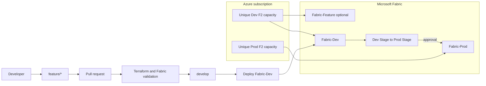

# Microsoft Fabric Banking CI/CD Template

[](https://github.com/regshih/fabric-banking-cicd-template/actions/workflows/validate.yml)

A reusable reference implementation for Microsoft Fabric CI/CD with Terraform, Azure DevOps Repos, Azure Pipelines, Fabric Git Integration, Deployment Pipelines, and Variable Libraries.

The included banking scenario is deterministic and synthetic. It contains no customer data, credentials, tenant identifiers, or production banking logic.

> `Fabric-Prod` is a release stage for the demonstration. F2 is not a sizing recommendation for a production workload, and both capacities incur charges while running.

## What this template creates

- Separate Dev and production-demo Azure resource groups and Fabric F2 capacities.
- `Fabric-Dev`, optional `Fabric-Feature`, and `Fabric-Prod` workspaces.
- `FabricAdmins`, `FabricDevelopers`, and narrowly scoped automation identities.
- Workload-identity-ready plan, apply, and content service principals.
- A two-stage Fabric Deployment Pipeline.
- Azure Pipelines for pull-request validation, approved Terraform apply, Dev deployment, and approved Prod promotion.
- Lakehouse, Fabric SQL Database, Notebook, Data Pipeline, Semantic Model, Power BI Report, and Variable Library examples.
- Optional private Azure Pipelines agent connectivity to a private Terraform state endpoint.

## Architecture



See [the detailed architecture](docs/architecture.md).

## Repository layout

```text
terraform/
  bootstrap/                 # state, resource groups, groups, service principals
  modules/                   # reusable infrastructure modules
  environments/dev/         # Dev capacity and Dev/Feature workspaces
  environments/prod/        # Prod capacity, workspace, deployment pipeline
fabric-items/                # fabric-cicd item definitions
fabric-git-items/            # native Fabric Git smoke-test item
pipelines/                   # Azure Pipelines and deployment scripts
tests/                       # offline structural validation
docs/                        # architecture, deployment, security, and operations
```

## Before deploying

1. Create a repository from this template. Use only the default branch; create `develop` and `feature/<name>` in your operational Azure DevOps repository.
2. Replace every example value in the three `terraform.tfvars.example` files and the Azure DevOps variable groups.
3. Choose globally unique capacity and state-storage names. Azure Fabric capacity resource names cannot contain hyphens.
4. Review expected cost, regional availability, tenant policies, role scopes, and approval ownership.
5. Never commit `.tfvars`, Terraform state/plans, `.env` files, keys, tokens, connection credentials, or a completed deployment inventory.

The complete sequence is in the [deployment guide](docs/deployment-guide.md).

## Local validation

```bash
python -m venv .venv
source .venv/bin/activate
python -m pip install --requirement requirements.txt
python tests/validate_repo.py
python tests/validate_public_repo.py

terraform -chdir=terraform/bootstrap init -backend=false
terraform -chdir=terraform/bootstrap fmt -check -recursive
terraform -chdir=terraform/bootstrap validate

terraform -chdir=terraform/environments/dev init -backend=false
terraform -chdir=terraform/environments/dev fmt -check -recursive
terraform -chdir=terraform/environments/dev validate

terraform -chdir=terraform/environments/prod init -backend=false
terraform -chdir=terraform/environments/prod fmt -check -recursive
terraform -chdir=terraform/environments/prod validate
```

No cloud resource is created by local validation.

## Branch and release model

1. Create `feature/<name>` from `develop`.
2. Commit code-first changes, or connect `Fabric-Feature` to the concrete feature branch and commit from Fabric.
3. Open a PR to `develop`; `terraform-plan.yml` validates infrastructure and Fabric definitions.
4. Merge to `develop`; `fabric-deploy.yml` deploys and verifies `Fabric-Dev`.
5. Open a release PR from `develop` to `main`.
6. Merge to `main`; the release waits for the protected Prod environment approval.
7. Promote through the Fabric Deployment Pipeline, activate the PROD value set, and verify the result.

## Authentication and secrets

- Azure Pipelines service connections use Microsoft Entra workload identity federation.
- Terraform and Fabric tooling reuse the federated Azure CLI session.
- Git contains placeholders and logical IDs only. Actual tenant, subscription, workspace, object, and connection IDs belong in protected Azure DevOps variable groups or ignored local files.
- The Fabric configured connection is a platform-specific bootstrap dependency; protect and rotate its credential outside Git.

## Important platform boundaries

- AzureRM manages Fabric capacity resources; the Fabric provider manages workspaces, roles, and deployment pipelines.
- An existing `fabric_workspace_git` connection cannot currently be imported by the provider. Leave `enable_git_integration=false` when adopting an API- or portal-created connection.
- Git-owned Fabric definitions are deployed with `fabric-cicd`; Terraform intentionally does not own the same items.
- Pull-request plans use `-refresh=false` because reading Fabric role assignments requires Workspace Admin. The approved apply job performs a fresh live plan.
- The narrowly scoped `TargetArtifactNameConflict` fallback runs only for that exact Fabric deployment-pipeline conflict. Other promotion failures remain fatal.

## Documentation

- [Deployment guide](docs/deployment-guide.md)
- [Architecture](docs/architecture.md)
- [Git integration](docs/git-integration.md)
- [Variable libraries](docs/variable-libraries.md)
- [Security model](docs/security.md)
- [Manual actions](docs/manual-actions.md)
- [Troubleshooting](docs/troubleshooting.md)
- [Private deployment inventory template](docs/live-environment.example.md)

## Scheduling

No recurring jobs are configured. Pipelines run from pull requests, merges to `develop` or `main`, or manual starts. Capacity pause/resume, credential rotation, drift checks, data refresh, backups, and repository synchronization remain explicit operator decisions unless you add reviewed automation.

## Contributing and support

Read [CONTRIBUTING.md](CONTRIBUTING.md) and [SECURITY.md](SECURITY.md) before opening a change or reporting a security concern. This repository is a reference implementation and is not an official Microsoft product or compliance certification.
