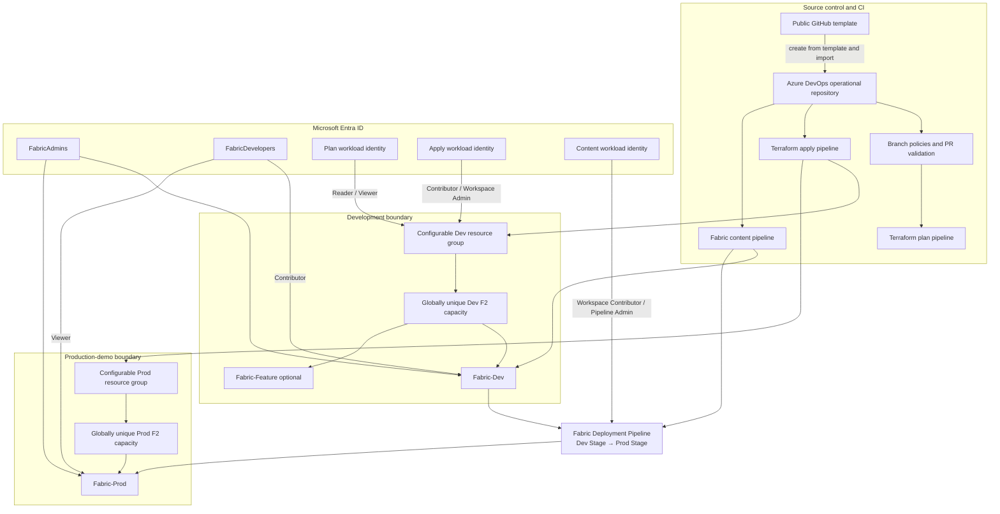
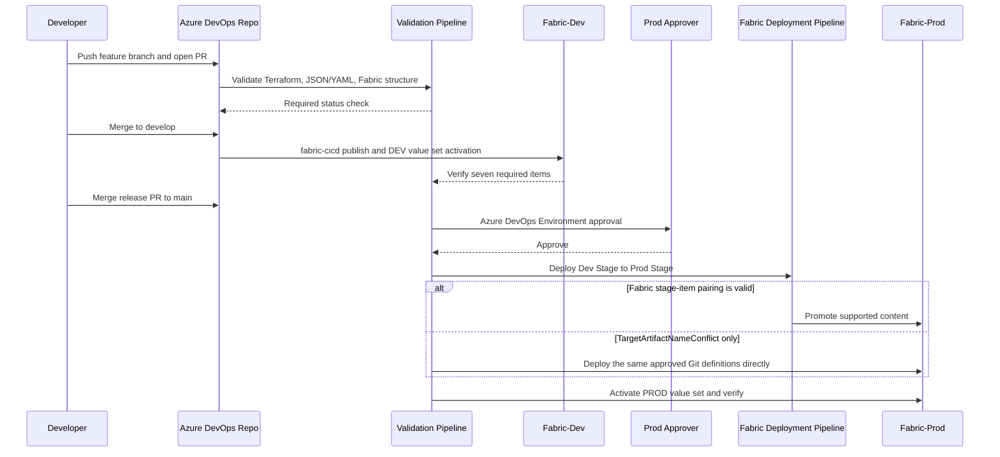

# Architecture

## Logical view

## Ownership boundaries

| Layer | Owner | State/source of truth |
|---|---|---|
| Bootstrap resource groups, state backend, groups, app registrations | Terraform bootstrap stack | Private Azure Storage, `bootstrap.tfstate` |
| Capacities, workspaces, access, deployment pipeline | Environment Terraform roots | Private Azure Storage, separate `dev.tfstate` and `prod.tfstate` keys |
| Existing Dev/Feature workspace Git connections | Fabric API/portal | Live Fabric connection metadata; Terraform creation is disabled because the provider cannot import an existing connection |
| Fabric item definitions | Azure DevOps Git | `fabric-items/` |
| Native Fabric Git smoke-test definition | Azure DevOps Git | `fabric-git-items/` |
| Fabric item data | Fabric/OneLake | Generated or ingested data, never Git |
| Environment values | Fabric Variable Library | Definition in Git; active value set is workspace state |
| Approvals | Azure DevOps Environments | Azure DevOps configuration |

## Deployment sequence

## Design choices

- Dev and Prod use different capacities and resource groups to contain blast radius and access.
- The feature workspace shares the dev F2 capacity to control POC cost.
- Prod isn't connected to an independently editable Git branch. The approved Prod job normally uses the Fabric Deployment Pipeline; only `TargetArtifactNameConflict` invokes the verified direct deployment of the same reviewed Git definitions.
- The report's semantic model contains a small embedded synthetic KPI table so deployment can be validated before data refresh. The Lakehouse notebook provides the operational synthetic dataset and can replace the embedded partition with Direct Lake in a later iteration.
